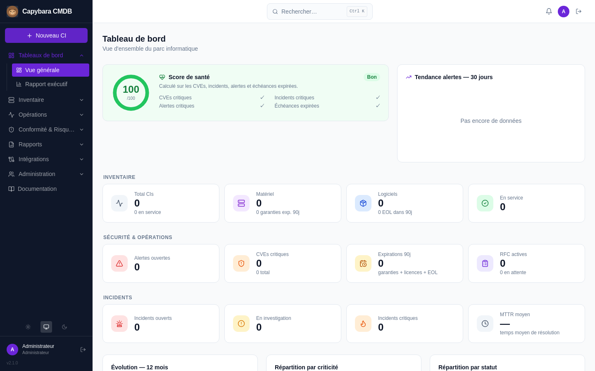
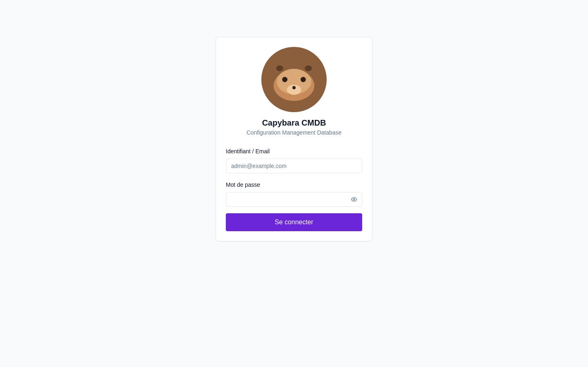
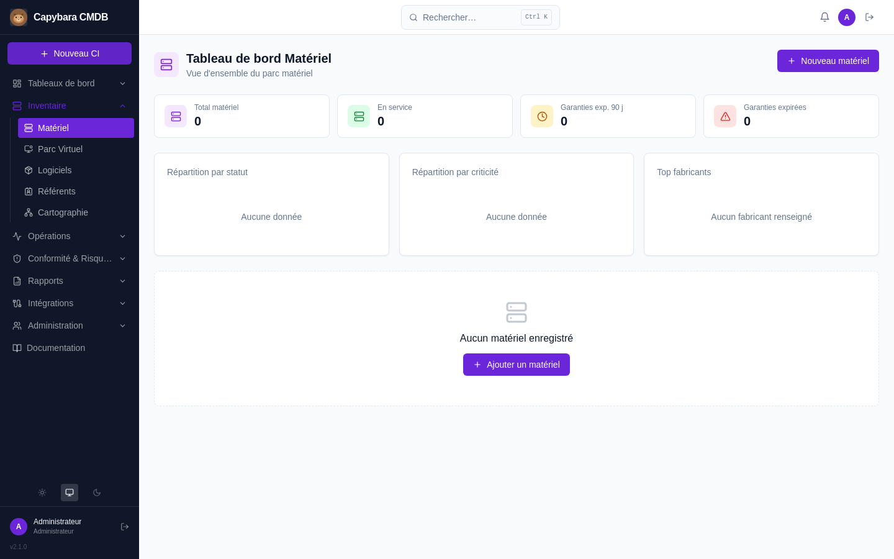

# 🦫 Capybara CMDB — Community Edition

**Capybara CMDB** est un référentiel de gestion de configuration (CMDB/ITSM) open source, complet et gratuit : inventaire matériel & logiciel, cartographie des dépendances, incidents, changements, contrats SLA, connecteurs LDAP/AD, agents natifs, SSO/SAML, tokens API et bien plus — sans palier payant, sans clé de licence.



## Fonctionnalités

- **Inventaire** matériel et logiciel, cartographie des dépendances entre CIs
- **ITSM** : incidents, demandes de changement (RFC), contrats SLA, licences logicielles
- **Connecteurs** : LDAP/Active Directory, GLPI, Microsoft EntraID/Intune, SSO/SAML
- **Agents natifs** Windows / Linux / macOS pour la remontée automatique d'inventaire
- **Automatisation** : notifications email, webhooks, tokens API pour vos intégrations
- **Réseau** : segments réseau, VLAN/DMZ, graphe de dépendances
- **Rapports** : export PDF/CSV, dashboard exécutif, veille CVE (NVD/CISA/OSV)

Voir le détail complet dans [`docs/FEATURES.md`](docs/FEATURES.md).

## Captures d'écran

| Connexion | Dashboard | Inventaire matériel |
|---|---|---|
|  |  |  |

## Démarrage rapide — moins de 30 minutes

### Prérequis

| Composant | Version minimale |
|-----------|-------------------|
| Docker Engine | ≥ 24 |
| Docker Compose (plugin) | ≥ 2.20 |
| Accès Internet sortant | Pour les images Docker et la veille CVE (optionnel) |

> Testé sur Ubuntu 22.04/24.04, Debian 12, Rocky Linux 9. Windows via Docker Desktop.

### Installation

```bash
# 1. Cloner le dépôt
git clone https://github.com/<votre-org>/cmdb-community.git
cd cmdb-community

# 2. Configurer les variables d'environnement
cp .env.example .env
```

Éditez `.env` et renseignez **au minimum les 4 valeurs obligatoires** :

```
POSTGRES_PASSWORD=   # openssl rand -hex 32
REDIS_PASSWORD=      # openssl rand -hex 32
SECRET_KEY=          # openssl rand -base64 32
ADMIN_PASSWORD=      # mot de passe du compte admin initial
```

```bash
# 3. Construire et démarrer
docker compose build
docker compose up -d

# 4. Appliquer les migrations de base de données
docker compose exec api alembic upgrade head
```

L'application est disponible sur **http://localhost:8000** (ou sur votre domaine si Traefik est configuré).

Connectez-vous avec `ADMIN_EMAIL` / `ADMIN_PASSWORD` définis dans `.env`.

---

## Variables d'environnement

Toutes les variables sont dans `.env` (copié depuis `.env.example`). Les variables avec `*` sont **obligatoires**.

### Application

| Variable | Description | Exemple |
|----------|-------------|---------|
| `DOMAIN` * | Domaine public de l'instance | `cmdb.example.com` |
| `ENVIRONMENT` | `dev` / `staging` / `prod` | `prod` |

### Base de données

| Variable | Description | Exemple |
|----------|-------------|---------|
| `DATABASE_URL` * | URL de connexion (Postgres/MySQL/MariaDB/MSSQL) | `postgresql+psycopg://cmdb:PASSWORD@db/cmdb` |
| `POSTGRES_DB` | Nom de la base | `cmdb` |
| `POSTGRES_USER` | Utilisateur PostgreSQL | `cmdb` |
| `POSTGRES_PASSWORD` * | Mot de passe DB — `openssl rand -hex 32` | *(généré)* |

### Redis & Celery

| Variable | Description | Défaut |
|----------|-------------|--------|
| `REDIS_URL` | URL Redis | `redis://:PASSWORD@redis:6379/0` |
| `REDIS_PASSWORD` * | Mot de passe Redis — `openssl rand -hex 32` | *(généré)* |

### Sécurité

| Variable | Description | Défaut |
|----------|-------------|--------|
| `SECRET_KEY` * | Clé JWT + chiffrement config — `openssl rand -base64 32` | *(obligatoire)* |
| `ACCESS_TOKEN_EXPIRE_MINUTES` | Durée de vie des tokens (minutes) | `480` |

### Compte admin initial

| Variable | Description | Exemple |
|----------|-------------|---------|
| `ADMIN_EMAIL` * | Email du compte admin créé au 1er démarrage | `admin@example.com` |
| `ADMIN_PASSWORD` * | Mot de passe de ce compte | *(à définir)* |

> Ce compte est le compte **break-glass** local, avec tous les droits admin. Conservez-le même si vous utilisez LDAP ou SSO.

### SMTP (optionnel)

| Variable | Description | Exemple |
|----------|-------------|---------|
| `SMTP_HOST` | Serveur SMTP | `smtp.office365.com` |
| `SMTP_PORT` | Port | `587` |
| `SMTP_USER` | Utilisateur | `cmdb@example.com` |
| `SMTP_PASSWORD` | Mot de passe | *(app password)* |
| `SMTP_FROM` | Adresse expéditeur | `cmdb@example.com` |

> La configuration SMTP peut aussi se faire depuis l'UI : **Admin > Connecteurs > SMTP** (priorité sur les variables `.env`).

### LDAP (optionnel — fallback)

Ces variables ne sont utilisées que si aucun connecteur LDAP n'est configuré en base. Préférez la configuration via **Admin > Connecteurs > LDAP**.

| Variable | Exemple |
|----------|---------|
| `LDAP_URL` | `ldap://dc01.corp.local` |
| `LDAP_BIND_DN` | `CN=svc-cmdb,OU=Services,DC=corp,DC=local` |
| `LDAP_BIND_PASSWORD` | *(mot de passe service)* |
| `LDAP_BASE_DN` | `DC=corp,DC=local` |

---

## HTTPS avec Traefik

Si vous utilisez **Traefik** comme reverse proxy, le `docker-compose.yml` fourni est déjà configuré (réseau externe `traefik-public` — renommez-le si vous utilisez un autre nom de réseau Traefik).

### Prérequis Traefik

```bash
# Créer le réseau externe si ce n'est pas déjà fait
docker network create traefik-public
```

Traefik doit être configuré avec :
- Entrypoint `websecure` sur le port 443
- Résolveur ACME (Let's Encrypt) actif
- Accès au socket Docker (`/var/run/docker.sock`)

### Configuration

Dans `.env`, définissez votre domaine :

```
DOMAIN=cmdb.votre-domaine.com
```

Les labels Traefik du `docker-compose.yml` gèrent automatiquement le routage HTTPS, le certificat TLS Let's Encrypt et la redirection HTTP → HTTPS.

> **Note — veille CVE :** le service `worker` (Celery) doit avoir un accès Internet sortant pour joindre les APIs externes (NVD, CISA KEV, OSV). C'est le cas par défaut. Si vous isolez le réseau, assurez l'accès sortant du worker, sinon l'ingestion CVE échoue silencieusement.

### Sans Traefik (accès local)

Si vous n'utilisez pas Traefik, exposez le port manuellement via un `docker-compose.override.yml` :

```yaml
services:
  api:
    ports:
      - "8000:8000"
    networks:
      - cmdb-internal
    labels:
      traefik.enable: "false"
```

```bash
docker compose -f docker-compose.yml -f docker-compose.override.yml up -d
```

L'application est alors accessible sur `http://localhost:8000`.

---

## Mise à jour

```bash
git pull origin main
docker compose build --no-cache
docker compose up -d
docker compose exec api alembic upgrade head
```

> Les migrations Alembic sont non-destructives. Les données existantes sont conservées.

---

## Backup & restauration

### Sauvegarder la base de données

```bash
docker compose exec db pg_dump -U cmdb cmdb > backup_$(date +%Y%m%d_%H%M%S).sql
```

### Sauvegarder les fichiers uploadés

```bash
docker run --rm -v cmdb_uploads:/data -v $(pwd):/backup alpine \
  tar czf /backup/uploads_$(date +%Y%m%d).tar.gz /data
```

### Restaurer la base de données

```bash
docker compose stop api worker
docker compose exec -T db psql -U cmdb cmdb < backup_20260101_000000.sql
docker compose start api worker
```

> **Important :** la `SECRET_KEY` de `.env` chiffre les configurations des connecteurs stockées en base. Sauvegardez ce fichier séparément — sans elle, les configurations chiffrées sont irrécupérables.

---

## Vérification de l'état

```bash
docker compose ps
docker compose logs api --tail=50
docker compose logs worker --tail=50
docker compose exec db pg_isready -U cmdb
```

L'état des services internes (Redis, Celery, connecteurs) est aussi visible depuis l'application : **menu État système**.

---

## Architecture

```
┌─────────────────────────────────────────────┐
│  Navigateur                                 │
│  React + TanStack Query + Tailwind CSS      │
└──────────────────┬──────────────────────────┘
                   │ HTTPS
┌──────────────────▼──────────────────────────┐
│  FastAPI (Python 3.12)                      │
│  API REST · OpenAPI · Auth JWT/LDAP/SSO     │
├─────────────────────────────────────────────┤
│  Celery Worker + Beat                       │
│  Tâches planifiées : CVE, alertes, rapports │
├──────────────┬──────────────────────────────┤
│  PostgreSQL  │  Redis                       │
│  Données     │  Broker Celery + cache       │
└──────────────┴──────────────────────────────┘
```

Documentation technique complète : [`docs/ARCHITECTURE.md`](docs/ARCHITECTURE.md)

---

## Personnalisation

Le nom de l'application, les couleurs et le logo se configurent depuis **Admin > Personnalisation**. Sans configuration, l'instance affiche par défaut le nom et le logo **Capybara CMDB** — vous pouvez les remplacer à tout moment ; supprimer un logo custom restaure automatiquement le logo Capybara par défaut.

## Licence

À définir — ce dépôt n'a pas encore de fichier `LICENSE` officiel. Une licence open source permissive sera ajoutée avant la première release publique.

Si vous forkez ce projet, une mention indiquant qu'il est basé sur **Capybara CMDB Community** est appréciée (non obligatoire).

## Support & contribution

- **Issues & bugs :** [GitHub Issues](../../issues)
- **Contribuer :** voir [`CONTRIBUTING.md`](CONTRIBUTING.md)
- **Documentation utilisateur :** accessible dans l'application (menu Documentation)
- **Documentation technique :** [`docs/`](docs/)
